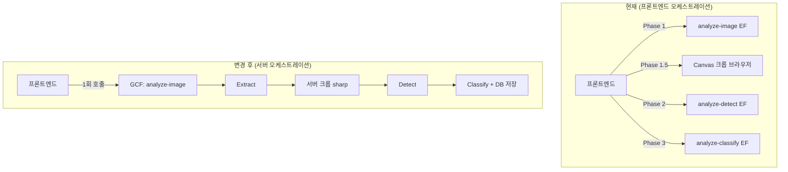

# 이미지 분석 파이프라인: GCF gen2 이전 계획

## 목표
이미지 분석 전체 파이프라인을 Google Cloud Functions gen2로 이전하여:
1. **사용자 이탈 가능**: 이미지 업로드 후 즉시 페이지를 떠날 수 있음
2. **타임아웃 해소**: 60분 wall clock으로 10분+ 처리 시간 완전 커버
3. **단일 함수 통합**: 3개 Edge Function → 1개 GCF로 단순화

## 현재 아키텍처 → 변경 후



> [!IMPORTANT]
> 기존 Edge Function(`analyze-image`, [analyze-detect](file:///c:/cheon/cheon_wokespace/edu/English-learning-assistant/.docs/log/analyze-detect), [analyze-classify](file:///c:/cheon/cheon_wokespace/edu/English-learning-assistant/.docs/log/analyze-classify))은 **삭제하지 않고 유지**한다 (폴백용).

---

## 제약 및 전제 조건

1. **GCP 프로젝트**: 기존 Vertex AI 프로젝트(`gen-lang-client-0516945872`)를 사용
2. **인증**: 같은 GCP 프로젝트이므로 ADC(Application Default Credentials)로 자동 인증 → 서비스 계정 키 불필요
3. **이미지 크롭**: Canvas API(브라우저) → `sharp`(Node.js)로 전환
4. **DB 연동**: `@supabase/supabase-js` npm 패키지 사용 (ESM URL import → npm import)
5. **기존 Supabase Edge Function 코드: 삭제하지 않음** (다른 기능은 그대로 사용)

---

## Proposed Changes

### GCP 설정 (브라우저 콘솔)

1. Cloud Functions API 활성화
2. Cloud Build API 활성화
3. 기존 서비스 계정에 Cloud Functions 권한 부여
4. Supabase 환경 변수를 GCF에 설정 (`SUPABASE_URL`, `SUPABASE_SERVICE_ROLE_KEY`)

---

### Cloud Function 코드

#### [NEW] `cloud-functions/analyze-image/index.js`

- Node.js 22 런타임, Express-free HTTP 핸들러
- 단일 함수로 전체 파이프라인 통합:
  1. 요청 수신 (images[], userId, language) → sessionId 즉시 반환
  2. 비동기 처리 시작:
     - 이미지 Storage 업로드
     - 세션 생성
     - Pass A: 구조 추출 (Gemini API)
     - Pass 0: 좌표 추출 (Gemini API)
     - **서버 크롭** (`sharp`로 이미지 디코딩/크롭)
     - Pass B: 필기 인식 (Gemini API)
     - Pass C: 분류 (Gemini API + responseJsonSchema)
     - DB 저장 (problems, labels, metadata)
     - 세션 완료

#### [NEW] `cloud-functions/analyze-image/package.json`

의존성:
- `@google/genai` - Gemini API
- `@supabase/supabase-js` - DB 연동
- `sharp` - 이미지 크롭 (Node.js 네이티브)

#### [NEW] `cloud-functions/analyze-image/shared/` (모듈 이식)

기존 Deno 모듈을 Node.js로 이식:
- [aiClient.ts](file:///C:/cheon/cheon_wokespace/edu/English-learning-assistant/supabase/functions/_shared/aiClient.ts) → `aiClient.js` (Deno.env → process.env)
- [analysisProcessor.ts](file:///C:/cheon/cheon_wokespace/edu/English-learning-assistant/supabase/functions/analyze-image/_shared/analysisProcessor.ts) → `analysisProcessor.js`
- [prompts.ts](file:///C:/cheon/cheon_wokespace/edu/English-learning-assistant/supabase/functions/_shared/prompts.ts) → `prompts.js`
- [models.ts](file:///C:/cheon/cheon_wokespace/edu/English-learning-assistant/supabase/functions/_shared/models.ts) → `models.js`
- [errors.ts](file:///C:/cheon/cheon_wokespace/edu/English-learning-assistant/supabase/functions/_shared/errors.ts) → `errors.js`
- [taxonomy.ts](file:///C:/cheon/cheon_wokespace/edu/English-learning-assistant/supabase/functions/_shared/taxonomy.ts) → `taxonomy.js`
- [validation.ts](file:///C:/cheon/cheon_wokespace/edu/English-learning-assistant/supabase/functions/_shared/validation.ts) → `validation.js`
- [imageCropper.ts](file:///C:/cheon/cheon_wokespace/edu/English-learning-assistant/supabase/functions/analyze-image/_shared/imageCropper.ts) → `imageCropper.js` (magick-wasm → sharp)
- 기타 모듈들 (sessionManager, problemSaver, labelProcessor 등)

**주요 변환 패턴:**
```diff
- import { createClient } from 'https://esm.sh/@supabase/supabase-js@2';
+ const { createClient } = require('@supabase/supabase-js');

- const key = Deno.env.get('KEY');
+ const key = process.env.KEY;

- import { GoogleGenAI } from "https://esm.sh/@google/genai@1.21.0";
+ const { GoogleGenAI } = require('@google/genai');
```

---

### 프론트엔드 수정

#### [MODIFY] [App.tsx](file:///C:/cheon/cheon_wokespace/edu/English-learning-assistant/English-learning-assistant/src/App.tsx)

`handleAnalyzeClick` 함수를 단순화:
- Phase 1~3 순차 호출 → **1회 호출**로 변경
- Canvas 크롭 로직 제거 (서버에서 수행)
- GCF URL로 엔드포인트 변경
- 호출 후 즉시 `sessionId` 반환 → 사용자 이탈 가능

```javascript
// 변경 후 (단순화)
const gcfUrl = import.meta.env.VITE_ANALYZE_GCF_URL;
const response = await fetch(gcfUrl, {
  method: 'POST',
  headers: { 'Content-Type': 'application/json' },
  body: JSON.stringify({ images: imagesArray, userId, language }),
});
const { sessionId } = await response.json();
// 즉시 완료 — 사용자 이탈 가능
```

#### [MODIFY] `.env` / [.env.local](file:///c:/cheon/cheon_wokespace/edu/English-learning-assistant/.env.local)

```
VITE_ANALYZE_GCF_URL=https://REGION-PROJECT_ID.cloudfunctions.net/analyze-image
```

---

## 배포 계획

### 1단계: GCP 설정 (브라우저)
- Cloud Functions API 활성화
- 서비스 계정 권한 설정

### 2단계: 코드 작성
- `cloud-functions/` 디렉토리 생성
- 모듈 이식 (Deno → Node.js)
- 단일 함수 작성

### 3단계: GCF 배포
```bash
gcloud functions deploy analyze-image \
  --gen2 \
  --runtime=nodejs22 \
  --region=asia-northeast3 \
  --memory=512MB \
  --timeout=600s \
  --trigger-http \
  --allow-unauthenticated \
  --set-env-vars="SUPABASE_URL=...,SUPABASE_SERVICE_ROLE_KEY=..."
```

### 4단계: 프론트엔드 수정 + 테스트
- [App.tsx](file:///C:/cheon/cheon_wokespace/edu/English-learning-assistant/English-learning-assistant/src/App.tsx) 수정
- `.env` 업데이트
- 개발 서버 테스트

---

## Verification Plan

### 자동 테스트
1. GCF 배포 후 `curl`로 직접 호출 테스트
2. 로그 확인: `gcloud functions logs read analyze-image --gen2`

### 수동 테스트
1. 프론트엔드에서 이미지 3장 업로드 → 즉시 sessionId 반환 확인
2. 반환 후 페이지 이탈 → DB에서 세션 완료 확인
3. "검수 대기" 목록에서 문제 표시 확인
4. Edge Function 로그에 호출 없음 확인 (GCF로만 처리)
