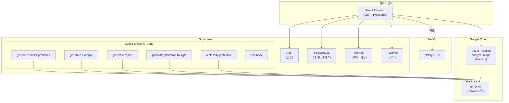
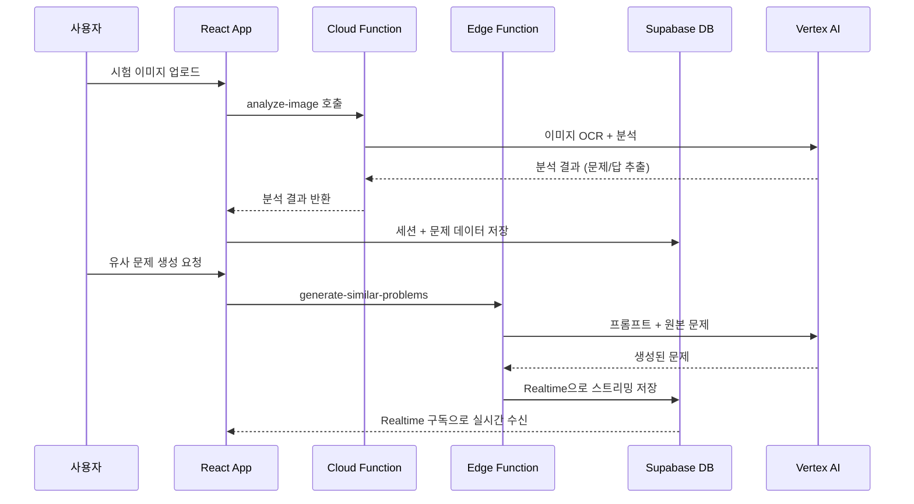
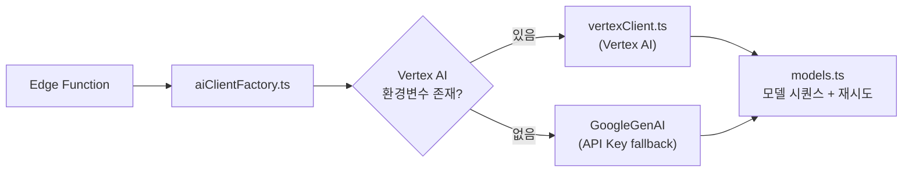

# 아키텍처 상세

## 시스템 전체 구조



## 데이터 흐름



## 레포 구조

```
English-learning-assistant/           ← 프로젝트 루트 (.git 위치)
├── English-learning-assistant/       ← React 프론트엔드 (빌드 대상)
│   └── src/
│       ├── pages/                    ← 라우트별 페이지 (8개)
│       ├── components/               ← 재사용 UI 컴포넌트 (30개+)
│       ├── services/db/              ← Supabase DB 접근 레이어
│       ├── hooks/                    ← 커스텀 훅
│       ├── contexts/                 ← ThemeContext, LanguageContext
│       ├── utils/                    ← 유틸리티 함수
│       └── types.ts                  ← 핵심 타입 정의
├── supabase/
│   ├── functions/                    ← Edge Functions (Deno 런타임)
│   │   ├── _shared/                  ← 공유 모듈
│   │   ├── generate-similar-problems/
│   │   ├── generate-example/
│   │   ├── generate-report/
│   │   ├── generate-problems-by-type/
│   │   └── reclassify-problems/
│   └── migrations/                   ← DB 마이그레이션 SQL
├── cloud-functions/
│   └── analyze-image/                ← Google Cloud Function (Node.js)
├── docs/                             ← 상세 기술 문서
└── .agents/workflows/                ← AI 에디터 워크플로
```

## AI 클라이언트 팩토리 패턴



### 모델 우선순위

| 순위 | 모델 | 용도 |
|------|------|------|
| 1 | gemini-3-flash-preview | 필기 감지 정확도 우수 |
| 2 | gemini-3.1-flash-lite-preview | 경량 모델 |
| 3 | gemini-2.5-pro | 범용 고성능 |
| 4 | gemini-2.5-flash | 범용 빠른 처리 |

모델 시퀀스 상세: `supabase/functions/_shared/models.ts`
프롬프트 템플릿: `supabase/functions/_shared/prompts.ts`
