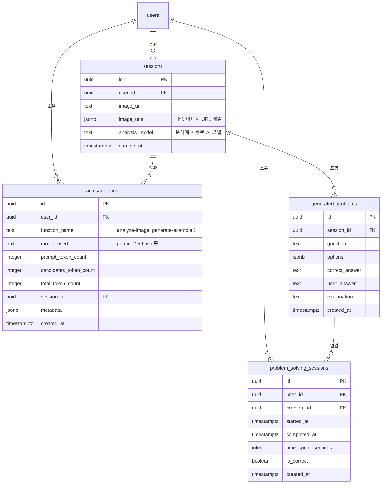

# 데이터베이스 스키마

## 테이블 관계도

## 주요 테이블

### `sessions`
분석 세션. 사용자가 이미지를 업로드하면 세션이 생성된다.
- `image_urls`: 다중 이미지 지원을 위해 jsonb 배열로 저장
- `analysis_model`: 분석에 사용된 AI 모델명 기록

### `generated_problems`
AI가 추출/생성한 문제. 각 세션에 종속된다.

### `problem_solving_sessions`
사용자의 문제 풀이 기록. 풀이 시간과 정답 여부를 추적한다.
- `UNIQUE(user_id, problem_id)`: 사용자당 문제별 하나의 풀이 기록만 존재

### `ai_usage_logs`
AI 호출별 토큰 사용량 로그. 비용 추적 목적.
- `function_name`: `analyze-image`, `generate-example`, `generate-similar-problems`, `generate-report`, `reclassify-problems`

## RLS 정책

모든 테이블에 Row Level Security가 활성화되어 있다.
- **일반 사용자**: 자신의 데이터만 SELECT/INSERT/UPDATE/DELETE 가능
- **서비스 역할** (`ai_usage_logs`): Edge Function에서 INSERT 가능 (`WITH CHECK (true)`)

## 마이그레이션 이력

| 파일 | 내용 |
|------|------|
| `20250101_create_problem_solving_sessions.sql` | problem_solving_sessions 테이블 + RLS |
| `20251217_add_sessions_analysis_model.sql` | sessions에 analysis_model 컬럼 추가 |
| `20251217_add_sessions_image_urls.sql` | sessions에 image_urls 컬럼 추가 + 기존 데이터 백필 |
| `20260127_add_token_usage_columns.sql` | ai_usage_logs 테이블 생성 |

마이그레이션 원본: `supabase/migrations/`
